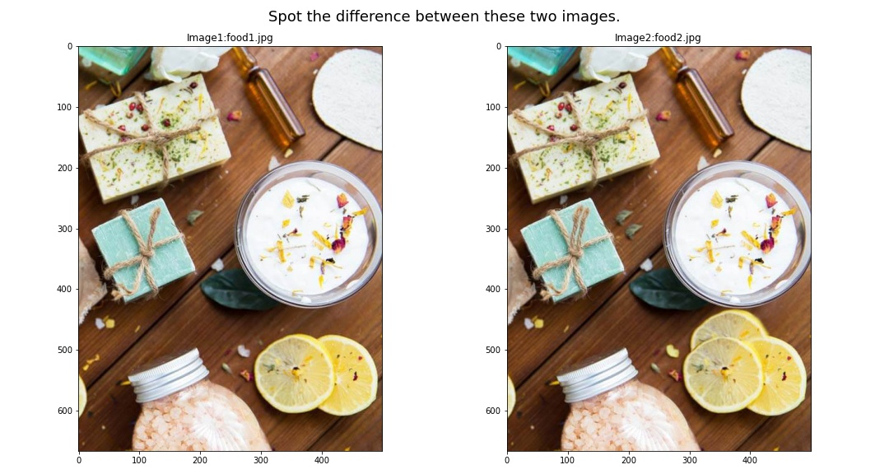
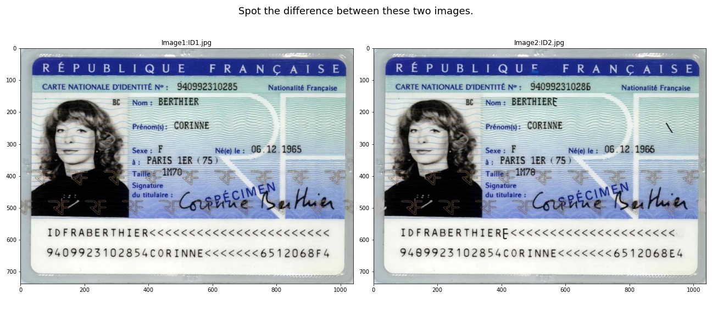

# Spot the difference between two images using image analysis python code

Just some simple python code to compare two images pixels by pixels in order to spot the differences.
There are many ways to achieve this. In this Python notebook we will spot the difference from two images by comparing each pixel of the images we want to compare.

In a next publication we will use AI Computer vision techniques to detect similarities.

## Python notebook

spot_the_difference.ipynb

## Examples

### Example 1

### Example 2

### Example 3

### Example 4

22-07-2022
Serge Retkowsky | serge.retkowsky@microsoft.com | https://www.linkedin.com/in/serger/
